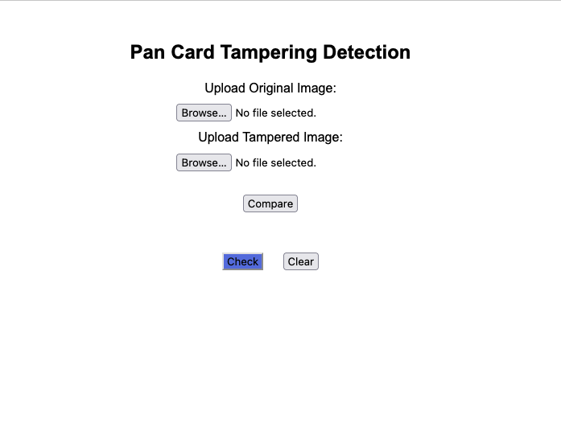
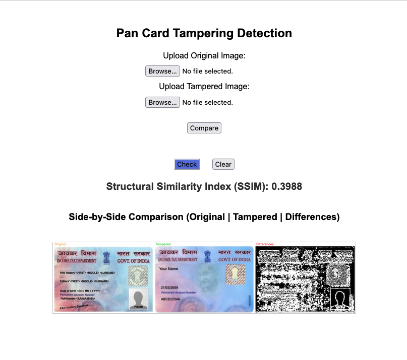

# 🛡️ Pan Card Tampering Detection (Machine Learning) App

This Machine Learning-based Flask web application helps detect tampering in PAN card images using Structural Similarity Index (SSIM). It allows users to upload an original and a tampered image, compares them, and highlights the differences.

---

##  About the Project

This project addresses the critical need for automated PAN card verification systems. By leveraging advanced computer vision techniques, it provides a robust solution for detecting tampered PAN cards, helping prevent identity theft and financial fraud.

---

##  Features

* Upload original and tampered images.
* Automatically resize images for valid comparison.
* Handle both grayscale and color images.
* Computes **Structural Similarity Index (SSIM)**.
* Visualizes:

  * **Original**
  * **Tampered**
  * **Differences (highlighted in red)**
* Side-by-side comparison with labeled borders.
* Clear button to reset UI and clear results (JS-based).

---

##  Demo






---

##  Requirements

See [`requirements.txt`](Pan_Card_Tampering_App/requirements.txt)

To install:

```bash
pip install -r requirements.txt
```

---

##  How to Run

1. Clone the repository:

   ```bash
   git clone https://github.com/AAdewunmi/Pan_Card_Tampering_Project.git
   cd pan-card-tampering-detector
   ```

2. Install dependencies:

   ```bash
   pip install -r requirements.txt
   ```

3. Run the Flask app:

   ```bash
   python app.py
   ```

4. Open in browser:

   ```
   http://127.0.0.1:5000
   ```

---

##  Folder Structure

```
pan-card-tampering/
│
├── static/
│   ├── uploads/         # Uploaded original and tampered images
│   └── results/         # Generated result and comparison images
│
├── templates/
│   └── index.html       # Frontend template
│
├── app.py               # Main Flask app
├── requirements.txt     # Python dependencies
└── README.md            # Project documentation
```

---

##  Tech Stack

* Python 3.x
* Flask
* OpenCV
* scikit-image (SSIM)
* HTML/CSS + JavaScript (for UI control)

---

##  Future Improvements

* Add drag-and-drop upload.
* API endpoint for programmatic access.
* Authentication (for secured access).
* Upload history or session management.

---

## Jupyter Notebook

See [`Pan_Card_Tampering_Project.ipynb`](notebooks/Pan_Card_Tampering_Project.ipynb)

---

##  Contributing

Contributions are welcome! Please submit pull requests with detailed explanations of changes. For major changes, please open an issue first to discuss the proposed modifications.

---

## Contact
If you have questions or suggestions, feel free to reach out or open an issue.

---

## Author

Adrian Adewunmi – [GitHub](https://github.com/AAdewunmi)

---

## 📝 License

This project is open-source under the MIT License.


